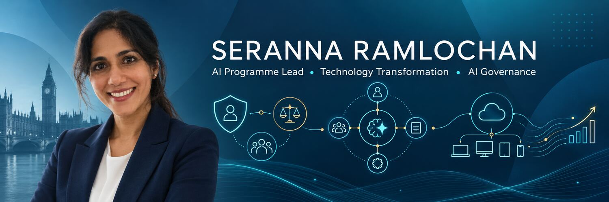
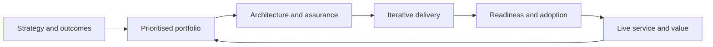
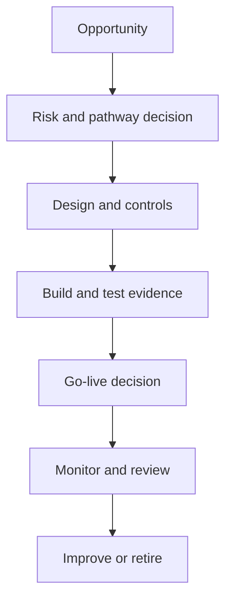

  

# Hello, I’m Seranna

Passionate about change, and leading complex technology and AI programmes from strategy through assurance, deployment and live-service transition. Over 15+ years, I have delivered transformation in private sector,  local government, central government, energy and other regulated environments - bringing together customers, architecture, data, engineering, governance, product, testing, change and senior stakeholders.

My current focus is helping organisations move from AI experimentation to controlled, measurable adoption. I have established delivery models and governance frameworks that enable teams to innovate while maintaining human accountability, privacy, security and operational readiness. I have applied learning developed through assignments on the Oxford AI-Driven Business Transformation Executive Programme to progress risk-based governance aligned with the principles of the EU AI Act and ISO/IEC 42001, including the introduction of Ethical Governance Assessments and AI Impact Assessments.

## What I bring

- **AI programme leadership** - integrated roadmaps, multi-squad delivery, prioritisation, dependencies, executive reporting and benefits focus
- **Responsible AI governance** - risk-tiered assurance, governance boards, policy, impact assessments, evidence gates and human oversight
- **Enterprise AI adoption**- Microsoft Copilot, AI agents, innovation labs, adoption pathways, training and operating models
- **Technology deployment** - cutover planning, readiness, release governance, hypercare, service transition and supplier coordination
- **Architecture-informed delivery** - credible collaboration across cloud, data, security, identity, integration and engineering teams
- **Organisation transformation** - navigating complex services, regulated data, procurement, cross-organisational governance and political accountability

## Selected impact

| Portfolio | My contribution | Outcome focus |
|---|---|---|
| AI innovation and governance | Led programme delivery and established risk-based governance, assurance forums, assessment frameworks and executive reporting | Safe progression from ideas and proofs of concept to controlled live use |
| Enterprise Copilot and agents | Coordinated enterprise adoption, governance, training, platform readiness and delivery pathways | Responsible adoption at scale with clear ownership and controls |
| End-user computing transformation | Led procurement and modernisation for a workforce of 4,000+, including Windows 11, Intune and multi-platform deployment | Secure, supportable devices and structured business transition |
| Digital risk and twin capability | Directed deployment across international teams for high-risk operational environments | Consistent release standards, readiness and adoption across regions |
| Machinery of Government change | Established delivery capability and cross-department product governance | Alignment across interdependent policy and technology initiatives |

## How I lead delivery

My approach is practical: establish the outcome, make ownership visible, apply assurance in proportion to risk, and define the evidence needed for the next decision. Governance should enable responsible delivery-not become a separate process detached from it.

## Responsible AI delivery model

## Areas of expertise

`AI governance` `AI assurance` `Programme delivery` `Portfolio management` `Microsoft Copilot` `AI agents` `Azure` `Microsoft Intune` `Windows 11` `Power Platform` `DevOps` `Architecture governance` `Product delivery` `Change and adoption` `Supplier management` `Service transition`

## Current professional development

- MBA in Leading Innovation and Change, University of York
- Oxford AI-Driven Business Transformation Executive Programme
- IAPP AI Governance Professional certification - in progress
- ISO/IEC 42001 AI Management Systems - in progress

## Explore my work

- [Selected case studies](case-studies.md)
- [AI governance and delivery principles](governance-principles.md)
- [LinkedIn](https://www.linkedin.com/in/seranna-ramlochan-279a9837)

### Interactive tools

- [Copilot Studio Cost Calculator](copilot-studio-cost-calculator.html) — reusable scenario model for comparing billable credit consumption, PAYG and pooled capacity costs across a generic agent portfolio.

## Let’s connect

I am interested in senior contract opportunities where AI governance, complex programme delivery and enterprise transformation need to work as one discipline.

> Public examples are intentionally anonymised and describe my delivery contribution without sharing confidential organisational, supplier, security or personal data.
