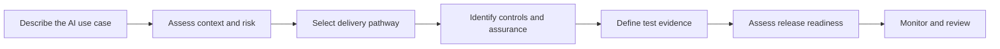
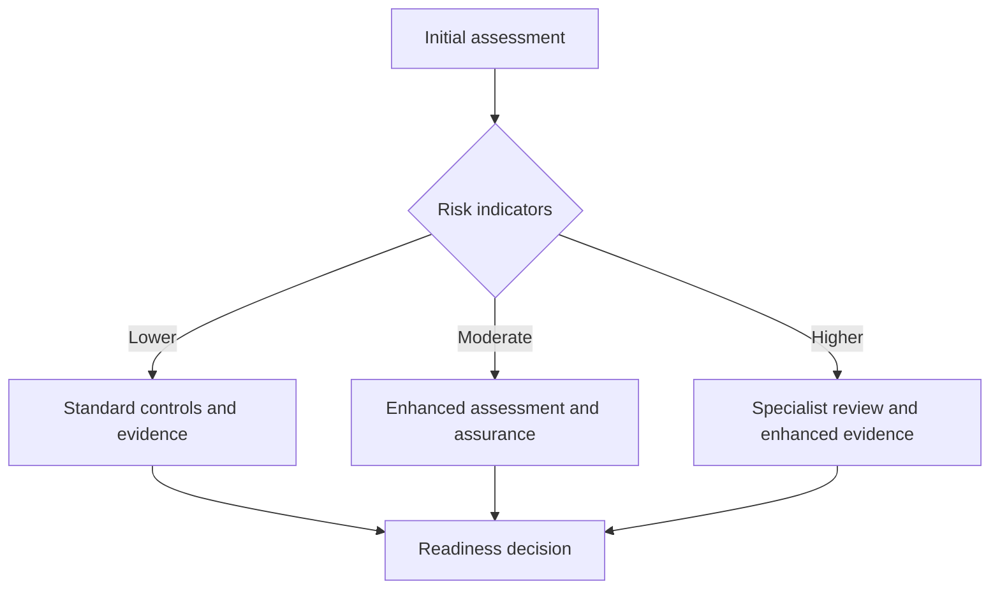

# Responsible AI Delivery Assistant

> **Portfolio concept:** a Copilot Studio agent that translates Responsible AI principles into a practical, risk-proportionate delivery pathway.

## Purpose

The Responsible AI Delivery Assistant is designed to help teams move an AI idea from **opportunity to controlled live use**. Rather than treating governance as a final approval exercise, the assistant brings delivery, risk, assurance and evidence requirements together from the outset.

It demonstrates how Responsible AI governance can be operationalised as part of delivery - helping users understand **what needs to happen, why it matters, who should be involved and what evidence is needed for the next decision**.

## User journey

## Core capabilities

| Capability | What the assistant does |
|---|---|
| **Use-case intake** | Captures purpose, users, affected people, data, AI capability, deployment model and intended decisions |
| **Risk triage** | Identifies risk indicators and recommends a proportionate assurance pathway |
| **Governance guidance** | Explains the assessments, reviews, owners and decision points likely to be required |
| **Control mapping** | Connects identified risks to human oversight, privacy, security, transparency and operational controls |
| **QA & assurance** | Generates suggested acceptance criteria, representative test scenarios and evidence requirements |
| **Release readiness** | Checks whether required evidence, ownership, residual-risk acceptance, support and monitoring are in place |
| **Lifecycle review** | Supports post-release monitoring, review, improvement and retirement decisions |

## Example assessment areas

The assistant would progressively establish:

- intended purpose and business outcome
- internal, external or public-facing users
- people potentially affected by the system or its outputs
- personal, confidential or sensitive data
- generative, predictive, classification or automation capability
- whether outputs inform or make consequential decisions
- level of human review and ability to override
- autonomous, scheduled or event-driven activity
- integrations, knowledge sources and external services
- potential safety, fairness, accessibility and transparency impacts
- expected scale, criticality and operational dependency

## Risk-proportionate pathway

The assistant should **support rather than replace accountable decision-makers**. Its classification is an initial triage based on defined organisational criteria.

Higher-risk indicators can trigger additional scrutiny rather than an automatic approval or rejection.

## Example output

**Provisional pathway:** Enhanced assurance

**Key considerations**
- processes personal or sensitive information
- generative AI output may influence professional activity
- accuracy and omission could affect service quality
- meaningful human review is therefore important

**Suggested assurance**
- privacy/data-protection assessment
- security and architecture review
- AI impact / ethical assessment
- defined human-oversight model
- representative QA testing
- accountable service-owner acceptance

**Evidence before release**
- measurable acceptance criteria
- representative test sample and coverage
- accuracy, error and failure results
- hallucination and unsupported-output testing where relevant
- escalation and human-override testing
- accessibility and user testing
- known limitations and residual risks
- monitoring, incident and review plan

## Copilot Studio design

The portfolio implementation can use:

**Agent instructions** - establish scope, Responsible AI principles, boundaries and expected behaviour.

**Structured intake** - topics and Adaptive Cards collect consistent information rather than relying entirely on free-text prompts.

**Decision logic** - variables and conditions map responses to risk indicators and assurance requirements.

**Knowledge** - approved governance standards, assessment guidance and templates provide grounded guidance.

**Prompts** - generate structured explanations, draft assessments, test scenarios and evidence checklists from collected information.

**Agent flows/actions** - support repeatable assessment and workflow steps where appropriate.

**Human decision points** - the assistant does not approve an AI system or replace specialist/accountable review.

## Responsible AI design principles

1. **Governance by design** - identify assurance requirements early.
2. **Risk proportionality** - increase controls and evidence as potential impact increases.
3. **Human accountability** - retain identifiable ownership and decision-making.
4. **Evidence over assertion** - release decisions should be supported by demonstrable testing and assurance.
5. **Transparency** - make reasoning, limitations and required actions understandable.
6. **Lifecycle governance** - assurance continues after go-live.
7. **Reuse before reinvention** - use consistent organisational controls and patterns where possible.

## Portfolio value

This concept demonstrates the intersection of:

`Responsible AI` · `Copilot Studio` · `AI governance` · `AI assurance` · `Risk management` · `Delivery governance` · `QA & testing` · `Human oversight` · `Operational readiness`

It is intended as a reusable demonstration framework rather than organisation-specific policy or legal advice.

---

*Portfolio concept by Seranna Ramlochan. Public material is intentionally generic and does not reproduce confidential organisational processes, security controls or client information.*
